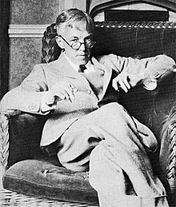

<table class="infobox biography vcard">
<tbody>
<tr>
<th colspan="2">

G. H. Hardy

 

<a title="Fellow of the Royal Society" href="https://en.wikipedia.org/wiki/Fellow_of_the_Royal_Society">FRS</a>

</th>
</tr>
<tr>
<td colspan="2">

Hardy,&nbsp;<abbr title="circa">c.</abbr>&thinsp;1927

</td>
</tr>
<tr>
<th scope="row">Born</th>
<td>

Godfrey Harold Hardy

 7 February 1877 

<a title="Cranleigh" href="https://en.wikipedia.org/wiki/Cranleigh">Cranleigh</a>, Surrey, England

</td>
</tr>
<tr>
<th scope="row">Died</th>
<td>1 December 1947&nbsp;(aged&nbsp;70) 

<a title="Cambridge" href="https://en.wikipedia.org/wiki/Cambridge">Cambridge</a>, Cambridgeshire, England

</td>
</tr>
<tr>
<th scope="row">Nationality</th>
<td class="category">United Kingdom</td>
</tr>
<tr>
<th scope="row">Alma&nbsp;mater</th>
<td><a title="Trinity College, Cambridge" href="https://en.wikipedia.org/wiki/Trinity_College,_Cambridge">Trinity College, Cambridge</a></td>
</tr>
<tr>
<th scope="row">Known&nbsp;for</th>
<td><a title="Hardy&ndash;Weinberg principle" href="https://en.wikipedia.org/wiki/Hardy%E2%80%93Weinberg_principle">Hardy&ndash;Weinberg principle</a> <a title="Partition function (number theory)" href="https://en.wikipedia.org/wiki/Partition_function_(number_theory)#Approximation_formulas">Hardy&ndash;Ramanujan asymptotic formula</a> <a class="mw-redirect" title="Critical line theorem" href="https://en.wikipedia.org/wiki/Critical_line_theorem">Critical line theorem</a> <a class="mw-redirect" title="Hardy-Littlewood tauberian theorem" href="https://en.wikipedia.org/wiki/Hardy-Littlewood_tauberian_theorem">Hardy-Littlewood tauberian theorem</a> <a title="Hardy space" href="https://en.wikipedia.org/wiki/Hardy_space">Hardy space</a> <a class="mw-redirect" title="Hardy notation" href="https://en.wikipedia.org/wiki/Hardy_notation">Hardy notation</a> <a class="mw-redirect" title="Hardy-Littlewood inequality" href="https://en.wikipedia.org/wiki/Hardy-Littlewood_inequality">Hardy-Littlewood inequality</a> <a title="Hardy's inequality" href="https://en.wikipedia.org/wiki/Hardy%27s_inequality">Hardy's inequality</a> <a title="Hardy's theorem" href="https://en.wikipedia.org/wiki/Hardy%27s_theorem">Hardy's theorem</a> <a title="Hardy&ndash;Littlewood circle method" href="https://en.wikipedia.org/wiki/Hardy%E2%80%93Littlewood_circle_method">Hardy&ndash;Littlewood circle method</a> <a title="Hardy field" href="https://en.wikipedia.org/wiki/Hardy_field">Hardy field</a> <a class="mw-redirect" title="Hardy-Littlewood zeta-function conjectures" href="https://en.wikipedia.org/wiki/Hardy-Littlewood_zeta-function_conjectures">Hardy-Littlewood zeta-function conjectures</a></td>
</tr>
<tr>
<th scope="row">Awards</th>
<td><a title="Fellow of the Royal Society" href="https://en.wikipedia.org/wiki/Fellow_of_the_Royal_Society">Fellow of the Royal Society</a> <a title="Smith's Prize" href="https://en.wikipedia.org/wiki/Smith%27s_Prize">Smith's Prize</a>&nbsp;<small>(1901)</small> <a title="Royal Medal" href="https://en.wikipedia.org/wiki/Royal_Medal">Royal Medal</a>&nbsp;<small>(1920)</small> <a title="De Morgan Medal" href="https://en.wikipedia.org/wiki/De_Morgan_Medal">De Morgan Medal</a>&nbsp;<small>(1929)</small> <a title="Chauvenet Prize" href="https://en.wikipedia.org/wiki/Chauvenet_Prize">Chauvenet Prize</a>&nbsp;<small>(1932)</small> <a title="Sylvester Medal" href="https://en.wikipedia.org/wiki/Sylvester_Medal">Sylvester Medal</a>&nbsp;<small>(1940)</small> <a title="Copley Medal" href="https://en.wikipedia.org/wiki/Copley_Medal">Copley Medal</a>&nbsp;<small>(1947)</small></td>
</tr>
<tr>
<td colspan="2"><strong>Scientific career</strong></td>
</tr>
<tr>
<th scope="row">Fields</th>
<td class="category"><a title="Mathematics" href="https://en.wikipedia.org/wiki/Mathematics">Mathematics</a></td>
</tr>
<tr>
<th scope="row">Institutions</th>
<td><a title="Trinity College, Cambridge" href="https://en.wikipedia.org/wiki/Trinity_College,_Cambridge">Trinity College, Cambridge</a> <a title="New College, Oxford" href="https://en.wikipedia.org/wiki/New_College,_Oxford">New College, Oxford</a></td>
</tr>
<tr>
<th scope="row">Academic advisors</th>
<td><a title="Augustus Edward Hough Love" href="https://en.wikipedia.org/wiki/Augustus_Edward_Hough_Love">A.&nbsp;E.&nbsp;H. Love</a> <a title="E. T. Whittaker" href="https://en.wikipedia.org/wiki/E._T._Whittaker">E.&nbsp;T. Whittaker</a></td>
</tr>
<tr>
<th scope="row">Doctoral students</th>
<td><a title="Mary Cartwright" href="https://en.wikipedia.org/wiki/Mary_Cartwright">Mary Cartwright</a> <a title="I. J. Good" href="https://en.wikipedia.org/wiki/I._J._Good">I.&nbsp;J. Good</a> <a title="Edward Linfoot" href="https://en.wikipedia.org/wiki/Edward_Linfoot">Edward Linfoot</a> <a title="Cyril Offord" href="https://en.wikipedia.org/wiki/Cyril_Offord">Cyril Offord</a> <a title="Harry Pitt" href="https://en.wikipedia.org/wiki/Harry_Pitt">Harry Pitt</a> <a title="Richard Rado" href="https://en.wikipedia.org/wiki/Richard_Rado">Richard Rado</a> <a title="Srinivasa Ramanujan" href="https://en.wikipedia.org/wiki/Srinivasa_Ramanujan">Srinivasa Ramanujan</a> <a title="Robert Alexander Rankin" href="https://en.wikipedia.org/wiki/Robert_Alexander_Rankin">Robert Rankin</a> <a title="Donald C. Spencer" href="https://en.wikipedia.org/wiki/Donald_C._Spencer">Donald Spencer</a> <a title="Tirukkannapuram Vijayaraghavan" href="https://en.wikipedia.org/wiki/Tirukkannapuram_Vijayaraghavan">Tirukkannapuram Vijayaraghavan</a> <a title="E. M. Wright" href="https://en.wikipedia.org/wiki/E._M._Wright">E. M. Wright</a></td>
</tr>
<tr>
<th scope="row">Other&nbsp;notable students</th>
<td><a title="Sydney Chapman (mathematician)" href="https://en.wikipedia.org/wiki/Sydney_Chapman_(mathematician)">Sydney Chapman</a> <a title="Edward Charles Titchmarsh" href="https://en.wikipedia.org/wiki/Edward_Charles_Titchmarsh">Edward Titchmarsh</a>&nbsp;<a title="Ethel Newbold" href="https://en.wikipedia.org/wiki/Ethel_Newbold">Ethel Newbold</a></td>
</tr>
<tr>
<th scope="row">Influences</th>
<td><a title="Camille Jordan" href="https://en.wikipedia.org/wiki/Camille_Jordan">Camille Jordan</a></td>
</tr>
<tr>
<th scope="row">Influenced</th>
<td><a title="Srinivasa Ramanujan" href="https://en.wikipedia.org/wiki/Srinivasa_Ramanujan">Srinivasa Ramanujan</a></td>
</tr>
</tbody>
</table>
 

<strong>Godfrey Harold Hardy</strong>&nbsp;<a title="Fellow of the Royal Society" href="https://en.wikipedia.org/wiki/Fellow_of_the_Royal_Society">FRS</a>&nbsp;(7 February 1877 &ndash; 1 December 1947)&nbsp;was an English&nbsp;<a title="Mathematics" href="https://en.wikipedia.org/wiki/Mathematics">mathematician</a>, known for his achievements in&nbsp;<a title="Number theory" href="https://en.wikipedia.org/wiki/Number_theory">number theory</a>&nbsp;and&nbsp;<a title="" href="https://en.wikipedia.org/wiki/Mathematical_analysis">mathematical analysis</a>.&nbsp;In biology, he is known for the&nbsp;<a title="Hardy&ndash;Weinberg principle" href="https://en.wikipedia.org/wiki/Hardy%E2%80%93Weinberg_principle">Hardy&ndash;Weinberg principle</a>, a basic principle of&nbsp;<a title="Population genetics" href="https://en.wikipedia.org/wiki/Population_genetics">population genetics</a>.

G. H. Hardy is usually known by those outside the field of mathematics for his 1940 essay&nbsp;<em><a title="A Mathematician's Apology" href="https://en.wikipedia.org/wiki/A_Mathematician%27s_Apology">A Mathematician's Apology</a></em>, often considered one of the best insights into the mind of a working mathematician written for the&nbsp;<a class="mw-redirect" title="Layperson" href="https://en.wikipedia.org/wiki/Layperson">layperson</a>.

&nbsp;

Starting in 1914, Hardy was the mentor of the Indian mathematician&nbsp;<a title="Srinivasa Ramanujan" href="https://en.wikipedia.org/wiki/Srinivasa_Ramanujan">Srinivasa Ramanujan</a>, a relationship that has become celebrated.&nbsp;Hardy almost immediately recognised Ramanujan's extraordinary albeit untutored brilliance, and Hardy and Ramanujan became close collaborators. In an interview by&nbsp;<a title="Paul Erdős" href="https://en.wikipedia.org/wiki/Paul_Erd%C5%91s">Paul Erdős</a>, when Hardy was asked what his greatest contribution to mathematics was, Hardy unhesitatingly replied that it was the discovery of Ramanujan.&nbsp;In a lecture on Ramanujan, Hardy said that "my association with him is the one romantic incident in my life".

 

<h2> Books </h2>
<ul>

                             

 <li><a target="_blank" href="https://github.com/manjunath5496/Godfrey-Harold-Hardy-Books/blob/master/ghh(1).pdf" style="text-decoration:none;">A Mathematician's
Apology</a></li>

 <li><a target="_blank" href="https://github.com/manjunath5496/Godfrey-Harold-Hardy-Books/blob/master/ghh(2).pdf" style="text-decoration:none;">A Course of Pure Mathematics</a></li>

<li><a target="_blank" href="https://github.com/manjunath5496/Godfrey-Harold-Hardy-Books/blob/master/ghh(3).pdf" style="text-decoration:none;">An Introduction to the Theory of Numbers</a></li>
 <li><a target="_blank" href="https://github.com/manjunath5496/Godfrey-Harold-Hardy-Books/blob/master/ghh(4).pdf" style="text-decoration:none;">The Integration of Functions of a Single Variable</a></li>                              
<li><a target="_blank" href="https://github.com/manjunath5496/Godfrey-Harold-Hardy-Books/blob/master/ghh(5).pdf" style="text-decoration:none;">Orders of Infinity</a></li>
<li><a target="_blank" href="https://github.com/manjunath5496/Godfrey-Harold-Hardy-Books/blob/master/ghh(6).rar" style="text-decoration:none;">Inequalities</a></li>
 <li><a target="_blank" href="https://github.com/manjunath5496/Godfrey-Harold-Hardy-Books/blob/master/ghh(7).pdf" style="text-decoration:none;">Some Famous Problems of the Theory of Numbers and in particular Waring's Problem </a></li>

 <li><a target="_blank" href="https://github.com/manjunath5496/Godfrey-Harold-Hardy-Books/blob/master/ghh(8).pdf" style="text-decoration:none;"> Divergent Series </a></li>
   <li><a target="_blank" href="https://github.com/manjunath5496/Godfrey-Harold-Hardy-Books/blob/master/ghh(9).pdf" style="text-decoration:none;">Cambridge Tracts in Mathematics and Mathematical Physics</a></li>
  
   
 <li><a target="_blank" href="https://github.com/manjunath5496/Godfrey-Harold-Hardy-Books/blob/master/ghh(10).pdf" style="text-decoration:none;">Ramanujan: Twelve Lectures on Subjects Suggested by His Life and Work </a></li>                              
</ul>
